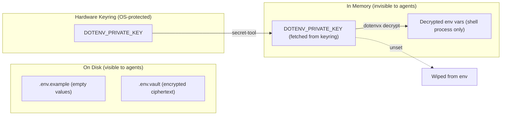

## infra/nix/docs/dotenvx/

[dotenvx](https://dotenvx.com/) provides encrypted `.env` files. Combined with
direnv (for seamless shell loading) and the OS keyring (for passwordless key
storage), it gives this repo a zero-plaintext, zero-prompt secret workflow.

### Why dotenvx over alternatives?

| Alternative | Problem |
|---|---|
| **Plaintext `.env`** | AI agents can `cat` or `grep` the file; accidental git commits leak secrets |
| **SOPS + Age** | Requires managing Age key distribution; more complex toolchain; YAML/JSON focus |
| **Infisical / Doppler** | Client-server architecture; requires accounts and network access |
| **HashiCorp Vault** | Running a server process; overkill for local dev |
| **direnv-only (no encryption)** | `.env.local` is still plaintext on disk; not shareable via Git |
| **1Password CLI** | Requires paid account; GUI dependency for some flows |
| **dotenv (original)** | No encryption; plaintext only |

### Design requirements

1. **No plaintext files on disk.** AI agents scanning the workspace must find
   nothing to exfiltrate. Only `.env.vault` (encrypted) and `.env.example`
   (empty values) exist in the repo.

2. **Zero password prompts.** The OS keyring unlocks on login. direnv fetches
   the decryption key silently in the background. Developers never type a
   password after initial setup.

3. **No client-server dependencies.** No background daemons, Docker containers,
   or SaaS accounts required. Everything runs on native system binaries.

4. **Git-shareable.** The encrypted `.env.vault` is committed. New team members
   clone the repo, run the setup script once, and have a working environment.

### Security model



- `.env.vault` contains only AES-256 encrypted ciphertext.
- The private key lives in the OS keyring (Linux Secret Service via
  `secret-tool`). It is not a file on disk.
- The key is fetched into a shell variable, used for decryption, then
  immediately `unset`.
- Decrypted values exist only in the current shell process memory. Background
  processes and file watchers cannot access them.

### Trade-offs

- **Initial setup cost.** Each developer must run `setup-secrets.sh` once
  and have `secret-tool` available (provided by GNOME Keyring or KDE Wallet).
- **Keyring dependency.** The workflow relies on the OS keyring daemon. On
  headless CI servers, you would use a different approach (e.g., CI secrets
  injected by the platform).
- **Single-vault model.** All secrets live in one `.env.vault`. For repos with
  hundreds of secrets, you might want per-service vaults.

### How direnv + dotenvx compose

[direnv](https://direnv.net/) handles the shell integration (auto-load on `cd`,
auto-unload on `cd` out). dotenvx handles the encryption layer. The `.envrc`
file wires them together:

```bash
use flake ./infra/nix          # load nix (includes dotenvx binary)
# ... fetch key from keyring, decrypt, unset key ...
```

This means application code (Python, Rust, Go, etc.) reads plain environment
variables — no secret-management libraries needed in any language.

### CI/CD considerations

For CI pipelines (GitHub Actions, GitLab CI), the recommended approach is:

1. Store `DOTENV_PRIVATE_KEY` as a CI secret variable.
2. Run `dotenvx run -- <your-command>` in the pipeline.
3. The key never appears in logs (dotenvx redacts it).

This is separate from the local keyring workflow — CI uses platform-native
secret injection rather than an OS keyring.
