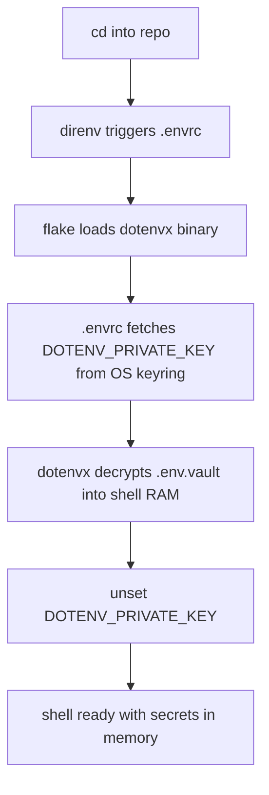

# dotenvx

[dotenvx](https://dotenvx.com/) encrypts `.env` files so secrets can be safely
committed to Git. It was created by the original author of `dotenv`.

In this repo, dotenvx is paired with `direnv` and the OS
keyring to provide a seamless, agent-proof secret workflow. No plaintext secrets
ever touch the disk.

## How it works



## Quick start (new developer)

```bash
# 1. Clone the repo (you already have .env.vault checked in)
git clone <repo-url> && cd pricing-perspective

# 2. Run the one-time onboarding script
./infra/nix/docs/dotenvx/setup-secrets.sh

# 3. Allow direnv — you're done
direnv allow
```

The onboarding script will:

1. Prompt you for each secret value (from `.env.example`).
2. Write a local `.env` file.
3. Encrypt it into `.env.vault`.
4. Store the decryption key in your OS keyring.
5. Delete `.env` and `.env.keys` from disk.

From this point on, every time you `cd` into the repo, direnv + dotenvx
silently decrypt the vault into your shell. No passwords, no files on disk.

## Day-to-day commands

```bash
# Add or update a secret
vim .env                    # edit plaintext locally
dotenvx encrypt             # re-encrypt into .env.vault
git add .env.vault && git commit -m "chore: rotate secrets"

# View which keys exist (values stay encrypted)
dotenvx get

# Decrypt into a subshell for debugging
dotenvx run -- bash
```

## Key rotation

If you suspect a key leak or want to rotate:

```bash
# Generate a new key pair
dotenvx encrypt             # produces new .env.vault + .env.keys

# Update the OS keyring with the new private key
grep DOTENV_PRIVATE_KEY .env.keys | cut -d= -f2 | xargs -I{} \
  secret-tool store --label="pricing-perspective" service pricing-perspective key DOTENV_PRIVATE_KEY <<< "{}"

# Commit and share
git add .env.vault && git commit -m "chore: rotate dotenvx keys"
rm -f .env.keys             # never leave keys on disk
```

## File inventory

| File | In Git? | Purpose |
|---|---|---|
| `.env.example` | Yes | Template listing all required keys (empty values) |
| `.env.vault` | Yes | Encrypted secrets (safe to commit) |
| `.env` | **No** | Temporary plaintext (deleted by setup script) |
| `.env.keys` | **No** | Decryption keys (deleted by setup script; stored in keyring) |

See `ARCHITECTURE.md` for why dotenvx over alternatives, and the security
model that blocks AI agents from exfiltrating secrets.
