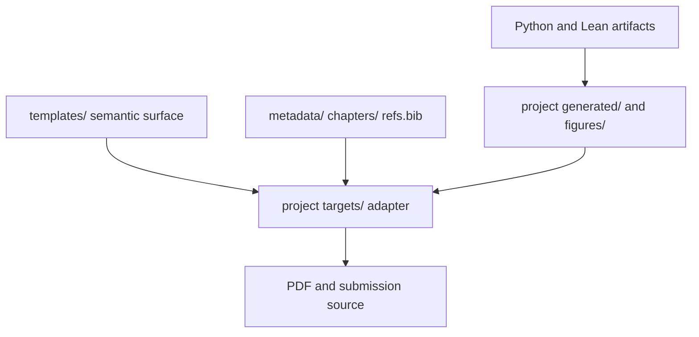

# Architecture

The filesystem encodes one dependency direction:

Chapters know manuscript semantics but not journal layout. Target adapters know
layout but not empirical production. Shared templates know neither project data
nor target-specific content. `tools/lint-boundaries` makes these fences blocking.

## One compiler, one artifact per venue

| Path | Engine | Purpose |
|---|---|---|
| Build, watch, release, audit | Tectonic/XeTeX | Every PDF, from the authoring loop to the DVC `render` stage |

`just latex::build` is the only recipe that produces a PDF. It writes
Tectonic's native V2 layout — `projects/<paper>/build/<target>/` holding
`<target>.pdf` with its `.log`, `.blg`, and intermediates — and `just
latex::bundle` writes that venue's upload archive beside them (`.zip` for `.tar.gz` for arXiv). The PDF and the archive are
`cache: false` DVC outs tracked in git (LFS), so repository
access alone is enough to read a paper or reproduce an upload.

This replaced a two-engine split (Tectonic for the inner loop, a pinned
TeX Live 2025 `pdfLaTeX` closure for a separate release build). The reasons for
collapsing it:

- **One builder, one artifact.** The old split produced the same PDF three
  times — `build/<target>/`, `build/release/`, and a copy under
  `data/chapters/` — and only the last was a DVC out. It was also
  git-ignored, so no rendered PDF was actually readable from a checkout.
- **No hand-maintained TeX closure.** The release path required naming every
  package the manuscripts load in `flake.nix` and re-deriving that list by
  `kpsewhich` whenever a `\usepackage` was added. Tectonic resolves packages
  from its pinned bundle at compile time, so adding one is a manuscript edit.
- **The audit engine now matches the build engine.** `tools/bundle-audit`
  recompiles staged sources with `tectonic -X compile --makefile-rules` and
  reads the emitted dependency rules for the input closure. Because bundle
  assets are served from a content-addressable cache rather than the
  filesystem, *any* absolute prerequisite outside the staging root is a
  genuine unstaged input — the check is exact rather than allow-listing a
  `/nix/store/*texlive*` prefix as the `latexmk -recorder` version had to.

**Residual risk, accepted.** Every project pins
`tlextras-2022.0r0`, so the effective asset set is TeX Live 2022, and nothing
in this repository now compiles under a newer TeX Live. arXiv recompiles
uploaded sources on its own, newer installation, so a divergence would surface
at upload rather than in CI. What bounds the risk: the target restricts itself
to conservative, long-stable packages (see *Publishing targets*), and
`bundle-audit` unpacks each archive into a clean directory and recompiles it
under `--only-cached` before it is ever uploaded. Revisit if a newer `tlextras`
bundle ships, or if an upload is rejected for an engine-version reason.

## Dependency management

- `infra/nix/flake.lock` pins Tectonic, ChkTeX, tex-fmt, and TexLab. No LaTeX
  engine or build driver is installed — ChkTeX is the only TeX tool, provisioned
  as `texliveInfraOnly.withPackages [chktex]` so it gets the texmf tree its
  global `chktexrc` macro tables live in. Standalone `texlivePackages.chktex`
  was measured and rejected: without those tables it does not know `\left`
  takes an argument and fires Warning 37 on ordinary display math, which
  `-l .chktexrc` cannot suppress (that flag adds a CmdLine list, it does not
  replace the global config). There is no ambient `tlmgr`
  state, no `texlive-full`, and no TeX package closure to maintain by hand:
  adding a `\usepackage` is a manuscript edit, resolved from the bundle at
  compile time, not a `flake.nix` change.
- Each `Tectonic.toml` points at `bundle/tlextras-2022.0r0-pricing-perspective.zip`
  — the subset of the upstream `tlextras-2022.0r0.tar` that this manuscript
  matrix actually resolves (~7 MB of the upstream 2.9 GB, ~570 files), vendored
  in git-LFS and regenerated by `just latex::bundle-refresh`. Tectonic reads a
  local directory or zip as a bundle provided it carries a `SHA256SUM` member,
  which is what makes this possible; the refresh recipe warms a scratch cache
  from the upstream URL, packages the resulting cache directory deterministically
  (sorted entries, `-X`, fixed 1980 mtimes), and writes the digest member.
  **There is no lockfile to commit, because Tectonic has none.** The `[doc]`
  table takes `name`, `bundle`, `extra_paths`, and `metadata` — no digest field;
  `tectonic -X build` has no lock-related flag; no `Tectonic.lock` is ever
  emitted. The URL is therefore not a deliberate alternative to a lockfile, it
  is the only pinning primitive the engine offers. (Earlier revisions of this
  file, and t24.16.3's F8, framed it as declining an available V2 lockfile.
  That feature does not exist — see the correction in
  `.context/chat/2026-07-19_modern-latex/README.md`.)
- **Why the bundle is vendored rather than fetched.** Pointing `Tectonic.toml`
  at the upstream URL made every build depend on a third-party host, and
  Tectonic pins such a bundle only by *trust on first use*: the first uncached
  fetch reads the served `SHA256SUM`, records it at
  `<cache>/bundles/hashes/<escaped-url>`, and extracts to
  `<cache>/bundles/data/<digest>/`. That digest was adopted from the server and
  never compared against anything under version control, so `--only-cached`
  asserted *no network*, not *these bytes*, and the pin held across machines only
  because the URL is immutable in practice (`HEAD`: 2881562112 bytes,
  `last-modified` 2022-09-25, stable ETag) — an upstream property, not one
  enforced here. It also failed in the ordinary way: the host answers **HTTP
  429** under load, CI shares egress IPs, and Tectonic degrades a rate-limited
  fetch to cache-only, so a build would die on `rm-lmr5.tfm not loadable`
  (with a spray of fontconfig `absolute path .../DejaVu*.ttf` warnings, XeTeX's
  fallback after a failed TFM lookup) rather than on a network error. Vendoring
  the resolved subset removes both problems at once: the bytes are committed, so
  the pin is *these bytes* and no longer trust-on-first-use, and no build reaches
  the network. `bundle-audit` records the bundle basename **and** its digest —
  read straight from the archive's `SHA256SUM` member, no cache involved — in
  each upload's `MANIFEST.json` alongside the Tectonic version; that triple is
  the reproducibility claim for TeX assets. Revisit when the successor `.ttb`
  bundles become Tectonic's default (`tectonic-texlive-bundles` was archived
  2024-10-02, so no newer `tlextras` exists to move to).
- Shared `.sty` files are reviewed repository source. Do not
  download packages during a build or use shell escape.
- CSL frontmatter in `.context/reference/*/README.md` is the reference source of
  truth; the projection pipeline exports project-local `refs.bib` files.
- Numeric results remain upstream pipeline artifacts. A renderer emits
  `\ppDeclareValue` bindings; TeX never reads analysis data directly.

## Project boundary

A project is independently buildable and has one `Tectonic.toml`. Named outputs
map to thin files under `src/targets/`; this avoids conditional preamble forests.
Metadata, chapters, generated artifacts, figures, and references are project
cohesive because they change and ship together.

Article projects expose their composition through `src/body.tex` and
`src/appendix.tex`. The arXiv adapter consumes those same interfaces,
so no consumer can acquire a paper body that differs from its published
targets.

Long-term dual sources are forbidden. LaTeX is the sole, canonical manuscript
renderer; `src/typst/` and the Typst render/slides/DAG tooling have been
removed. Canonical ownership flipped per paper only after both compilers
passed, references and generated values resolved, extracted text and
equations were audited, the PDF was visually inspected, and a clean submission
bundle built without repository-external files.

## Publishing targets

`arxiv` uses conservative `article` plus long-stable packages — chosen to
compile under a publisher's `pdfLaTeX` as readily as under Tectonic's XeTeX,
since arXiv recompiles the upload itself — and is verified from a source-only
staging directory. Its `.tar.gz` carries the BibTeX, public composition
interfaces, chapters, generated bindings, and figures, so it is portable rather
than dependent on a local TeX installation.

## Figure transport

Figures ship as matplotlib **PGF** rather than standalone vector PDF, adopted in
`.context/plan/infra-tooling/tasks/t38-figures-pgf-pilot/`. The drawing is still
produced and cached by the DVC figure stages — what moves to compile time is only
the *text*, which Tectonic then typesets in the document's own font at the
document's own point size. A figure included at `0.62\linewidth` used to print its
8 pt tick labels at 5 pt; under PGF a point is a point.

This costs four things, each accepted knowingly:

- **`templates/pp-manuscript.sty` grows four lines.** `pgf`, `import` and
  `\mathdefault` are required by matplotlib's own PGF header; they sit beside the
  `graphicx` that already lives there, because the figure transport is a
  repository-wide semantic rather than the per-target layout choice `targets/`
  owns. The same file defines `\ppfigure{<frac>}{<name>}`, which expands through
  an empty-by-default `\ppfiguresuffix` to
  `\import{images/}{<name><suffix>.pgf}` — `import`, never `\input`, is what
  makes a figure's raster sidecars resolve next to the `.pgf` instead of next
  to `main.tex`. `<frac>` sets nothing at compile time; it records the authored
  width so `tests/figures/test_print_size.py` can check the renderer against the
  manuscript rather than against itself.
- **A fourth requirement matplotlib does not state.** Its PGF escaping neutralises
  `^` and `%` but leaves `_` to the `underscore` package, which these manuscripts
  do not load. A literal underscore in a figure label is therefore a compile
  error, and the fix belongs in the label: raw identifiers were never presentable
  in a manuscript legend.
- **A figure is no longer one file.** `imshow` cannot be vector paths, so a
  rasterising figure emits `<name>-imgN.png` beside its `.pgf`. DVC `outs:` and
  `tools/stage-images` both account for that; the bundle audit is what proves it.
- **One default measure.** PGF is placed at natural size and cannot be
  rescaled, so `TEXTWIDTH_IN` targets `arxiv` (426.79 pt) and every manuscript
  figure is authored to it.

The residual risk is that arXiv recompiles the upload on its own TeX Live. `pgf`
and `import` are both long-stable, which is the same conservatism the `arxiv`
target already applies to every other package.

## Rejected alternatives

| Alternative | Reason |
|---|---|
| `texlive-full` | Large, slow, and hides the actual dependency closure |
| A second TeX Live release path beside Tectonic | **Adopted the opposite way, knowingly.** A separate pinned-TeX Live build did reproduce publisher `pdfLaTeX` behavior, and giving that up is a real loss of parity evidence (see the residual risk above). It cost: three copies of every PDF with only the untracked one wired to DVC, a hand-derived TeX package closure that had to be re-mapped for each new `\usepackage`, and an audit gate compiling on a different engine from the builder. One engine plus an unpack-and-recompile audit was judged the better trade |
| Standalone `texlivePackages.chktex` (no texmf tree) | Loses the global `chktexrc` macro tables, so `\left(` trips Warning 37 on display math and `just latex::lint` fails; `-l` cannot restore them |
| Lua data loading | Incompatible with the Tectonic/XeTeX renderer |
| Permanent Typst-to-LaTeX conversion | Conversion loses citations, math, semantic environments, and typography |
| One global preamble | Couples every paper to every target and grows without ownership |
| Duplicated `.typ` and `.tex` bodies | Creates two drifting sources of truth |
| LuaLaTeX + `unicode-math`/`lua-unicode-math` | arXiv targets use conservative `article`; QF adapters use publisher classes (`rQUF2e` for Paper 1, generic `interact` for Papers 3 and 5); the renderer is Tectonic/XeTeX, and none runs LuaLaTeX |
| TeX-side data loaders (`datatool` v3, `yamlvars`, `jsonparse`, Lua `utilities.json`) | Numbers are produced upstream in the DVC DAG and bound via `\ppDeclareValue`/`\ppvalue`; compile-time loading reintroduces the compile-time data coupling rejected above |
| `keytheorems` + `tcolorbox` shaded theorems | QF/arXiv expect plain `amsthm` styling; the current per-type `amsthm` counters are correct and portable |
| PDF/UA-2 tagging (`\DocumentMetadata{tagging=on, math/setup=mathml-SE}`) | Kernel tagging needs LuaLaTeX and is incompatible with the pinned engines and publisher classes; `tikz-cd`/`xypic` are also tagging-incompatible; watch only if a future venue mandates accessible PDFs |
| `minted` / shell-escape syntax highlighting | `lint-boundaries` blocks `\write18`/`tlmgr`; Tectonic sandboxes shell escape; no code listings appear in manuscripts |
| `llmk`/`cluttex`/`arara` build orchestration | Aux-file isolation and multi-pass are already handled by Tectonic's V2 `build/<target>/` dirs; `just` is the orchestrator |
| `tcolorbox` styled/rounded content boxes | Callout boxes are non-idiomatic for QF/arXiv and no manuscript needs them; same rationale as the `keytheorems`+`tcolorbox` row above |
| `etoolbox` command patching / show-rules (`\pretocmd`, `\apptocmd`) | Document-wide restyling is a thin-`targets/` layout concern, not manuscript content; where a hook is genuinely needed the kernel's native `\AddToHook` supersedes patching |
| Hand-authored in-document `tikz` drawing | Figures come from the DVC figure stages, so the drawing stays reproducible and cached; hand-authoring a schematic in TikZ moves it into the manuscript, where it drifts from the data that motivated it. A maintainability trade-off to watch, not adopt. **This row does not cover matplotlib's `.pgf` export** — see the adopted row below |
| `SciencePlots` (third-party `.mplstyle` sheets) | Its base `science` style sets `text.usetex : True`, which must stay False here — the PGF backend routes text through LaTeX regardless, and `usetex` additionally demands `cm-super`, which the `pgf-metrics` closure does not carry. It also sets a `prop_cycle` whose 2nd and 4th entries (`00B945`, `FF2C00`) are the green/red pair the Okabe-Ito palette in `figures/_common.py` exists to avoid, and which `tests/figures/test_palette_discipline.py` could not see at all, since a cycle assigns colour positionally rather than by name. Its `figure.figsize : 3.5, 2.625` belongs to the single-column-then-`\includegraphics`-rescale model t39 removed, and its `xtick.top`/`ytick.right` draw ticks on the two spines this repo omits. Decisively: it sets neither `pgf.texsystem` nor `pgf.rcfonts`, so it can only layer *under* `_style()` and never replace it — adoption retires 2 of 13 rcParams lines and adds four overrides plus a dependency. Its frame and tick settings were taken by hand instead |

## Considered modern options (not adopted)

Sources: `.context/chat/2026-07-19_modern-latex/figures/deep_research__tools.md`
and the expl3/TikZ Typst-parity survey (2026-07-23 session).

`badness` (Rust LSP + linter + formatter, lossless CST) is an **optional,
low-priority spike** only — not a planned adoption. It could complement or
replace `texlab` + ChkTeX, but only if it handles the XeTeX dialect
and the publisher classes without false positives and integrates with the existing
prek/Nix wiring; a time-boxed evaluation, not a commitment.

`expl3` (the LaTeX3 programming layer) is **already the foundation, not a new
dependency**: the 2020+ kernel ships it, and `xfp` (`\fpeval`) and `siunitx`
are l3-based and already loaded by `pp-manuscript.sty`. It is the preferred
idiom for shared semantic macros — in particular the `\ppnum{key}` /
`\ppnum[precision]{key}` display macro and its per-key precision keys
(`l3keys`) proposed in t24.16.1 — rather than hand-rolled `\csname`
constructions. This is an implementation choice inside existing macros, not an
engine or dependency change. The other Typst-parity candidates from that survey
(`tcolorbox`, `etoolbox` show-rules, in-document `tikz`) are rejected above for
this repository's constraints.
