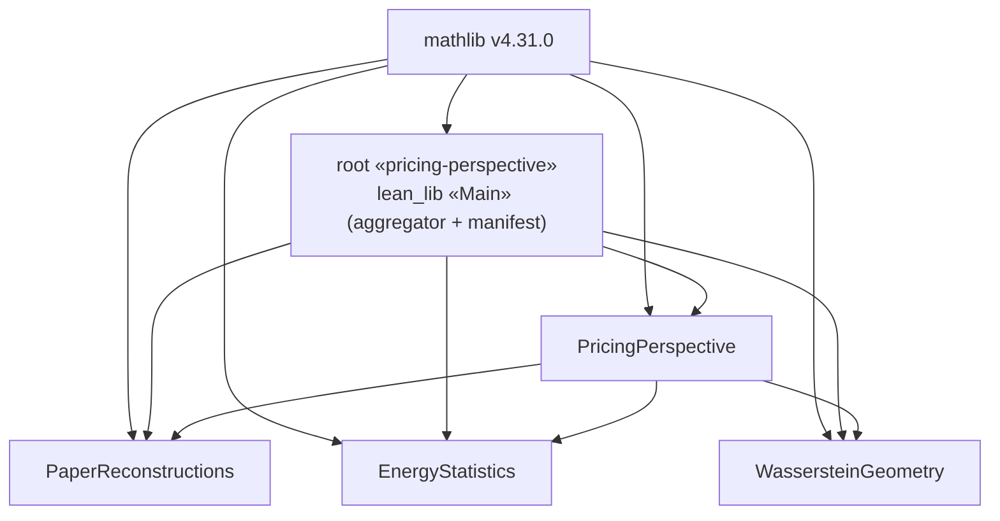

## Lean — why this shape

The Lean layer is a [Lake](https://github.com/leanprover/lean4/tree/master/src/lake)
multi-package workspace: a root package that pulls in local sub-packages via
`require … from "…"`. It mirrors the `uv` workspace pattern in `src/python/` — one
`lake build` at the root rebuilds everything.

Lake has no `[workspace]` manifest (unlike cargo/uv); the *root package itself* is the
workspace, and `lean_lib «Main»` is a thin aggregator that exists only to `require` every
member and give `lake build` a single default target. Package inventory lives in
`README.md`; the rules agents must follow live in `AGENTS.md`.

### One-way dependencies

`EnergyStatistics`, `WassersteinGeometry`, and `PaperReconstructions` are foundations:
mathlib-only, and standalone/mathlib-publishable. `PricingPerspective` — the
paper-specific contributions — depends on all three; arrows never point back. Lean forbids
*cycles* but not this *direction*, so it is a house rule (`AGENTS.md` §2), not a compiler
guarantee.

### File organization

Within a package, files are organized **by mathematical concept, not by kind** — mirroring
mathlib's `Defs.lean`/`Basic.lean` convention rather than a generic `Types.lean`/`Model.lean`
split. `EnergyStatistics` and `WassersteinGeometry` are mathlib-publishable, so matching
mathlib's layout now keeps a future upstream PR diff small. It also keeps files at Lean's real
unit of compilation and cache invalidation: a structure and its lemmas live together, so
touching one concept's proof doesn't invalidate every consumer's build the way a shared
`Types.lean` would.

A concept that outgrows a single file is **promoted to a directory of the same name**, never
split across unrelated files. `packages/PaperReconstructions/PaperReconstructions/Ross1976/`
is the existing example: `Types.lean`/`Model.lean`/`Moments.lean` hold the pieces, and
`Ross1976.lean` stays a thin roll-up (imports + headline theorems + source docstring), so
`import PaperReconstructions.Ross1976` never changes at any call site. Size ceilings and the
promotion mechanic are enforced as a rule in `AGENTS.md` §2.

### Hoisted mathlib

mathlib is declared at the root **and** redeclared in every sub-package `lakefile.lean`,
all pinned to the same tag. Lake has no `[workspace.dependencies]` inheritance (cargo/uv
do), so this redundancy is the price of letting `lake exe cache get` — and each standalone
foundation build — resolve from either the root or a sub-package directory. The cost is
that the pins must stay identical; that is enforced as a rule, not by the language.

### Pinned toolchain

Lean is pinned to `v4.31.0` and provisioned by the nix dev shell via `lean4-nix` as a
GC-safe store path (not imperative `elan`); `just lean::doctor` is the repair path if a
nix GC ever orphans it. Keep `infra/nix/flake.nix` `leanManifest` (tag + hash) in lockstep
with `src/lean/lean-toolchain`. `lake-manifest.json` records resolved dependency revisions.

### External dependencies

| Dependency | Role | Decision |
|---|---|---|
| `mathlib4` | Topology, measure theory, probability, inner-product spaces, convexity | Mandatory base for all packages |
| `batteries`, `aesop` | Utility / proof search | Use *through* mathlib; do not add directly |
| `doc-gen4`, `mdgen` | HTML docs from docstrings | Root only (`just lean::docs`) |
| `formal-mathfin` (Reservoir `@raphaelrrcoelho/MathFin`) | FTAP tower, Itô, Black–Scholes, coherent risk measures; two-asset Markowitz | **Reference only — port, never `require`** (below). Apache-2.0, sorry-free, axioms-clean |
| `brownian-motion` | Stochastic-process formalization | Adopt only if continuous-time term-structure work starts |
| `pythia` (`@athanor-ai`) | Applied-math tactic cascade; broad `Finance/Portfolio` + `Finance/Risk` surface | Out of scope — statements are shallow (unconstrained reals, two-asset), below our layer |
| `formal-quant` (`@roigecode`) | Pre-trade risk gates, ledger, execution harness | Out of scope — verified trading *infrastructure*, not financial mathematics |
| `physlib` | Physics; `QuantumInfo/ForMathlib/HermitianMat` PSD and trace inequalities | Out of scope — its one adjacent result is already reachable from mathlib (below) |
| `EconCSLib` (`@gametheoryinlean`, `@nikhgarg`), `Econlib-lean`, `cslib`, `lean-social-choice`, `formal-conjectures`, `verso`, `lean-ga` | Game theory, mechanism design, EconCS papers, CS foundations | Out of scope — avoid |

Rows below `brownian-motion` record a **2026-08-07 survey** of candidate Lean finance /
economics libraries. They are listed with their real domain rather than lumped into a bare
denylist, so a future proposal is answered by the reason rather than re-run.

**Why port rather than `require` — `formal-mathfin`.** Its
`MathFin/Foundations/FTAPOnePeriodVector.lean` proves `ftap_one_period_vector`, whose
NoArbitrage → EMM direction is exactly the gap left open in
`PaperReconstructions/Ross1976/Model.lean` (carried in `sorry-allowlist.txt`; the docstring
there already sketches the same softplus-potential route). Depending on it is the wrong
trade: it pins `v4.32.0` against our `v4.31.0` and transitively requires `BrownianMotion`
plus `LeanArchitect` — a heavy tree for one theorem. `PaperReconstructions` is
paper-specific rather than mathlib-publishable, so an attributed Apache-2.0 port of that
single file closes the gap without touching the foundations' mathlib-only rule. Nothing
else there is worth taking: its `Portfolio/` layer is two-asset closed forms and basic
`portfolioVarN` PSD, well below the `portfolio_variance_lower_bound` and covariance-space
Hilbert structure we already have. `RiskMeasures/` (coherent axioms, Rockafellar–Uryasev,
worst-case, spectral) is a later candidate only if certified risk caps or ambiguity-robust
variance want an axiomatic risk layer.

**Spectral clip is the case that most tempts a `physlib` dependency — and it buys
nothing.** The survey surfaced `physlib`'s `cfc_nonneg_iff`
(`0 ≤ A.cfc f ↔ ∀ i, 0 ≤ f (eigenvalues i)`), which is the eigenvalue-clip PSD repair
almost verbatim. It is still not worth depending on, for two independent reasons.
`spectralClip` and its PSD and already-PSD-idempotence lemmas have been proven since
t01.2.2 in `PricingPerspective/Discrete/CorrelationMatrix.lean`, by explicit recomposition
over `Matrix.IsHermitian.eigenvectorUnitary`. And had they not been, the pinned mathlib
already carries the functional-calculus route on its own:
`Mathlib/Analysis/Matrix/HermitianFunctionalCalculus.lean` supplies
`Matrix.IsHermitian.cfc` and `cfc_eq`. The `physlib` result is staged under
`QuantumInfo/ForMathlib/` and headed upstream regardless.

### Claim manifest — publication bridge

Manuscripts must state "machine-checked in Lean" without carrying Lean identifiers,
source, or a toolchain. `tools/claim-manifest/` is that bridge: a human-authored
`mapping.toml` (manuscript claim label ↔ fully-qualified declaration) is the *only*
place the two are linked. Three decisions make it trustworthy:

- **Nothing is inferred from name/notation similarity** (t24.1 "B1"): a similar name is
  not a proof of the claim, so a human authors each mapping and `extract.py` re-checks the
  named declaration against the kernel — it exists, no `sorryAx`, only the allowlisted
  axioms — before anything counts as verified.
- **The statement is pinned, not just the name** (2026-08-02 audit). A declaration name is
  a weak referent: weakening a mapped theorem in place leaves the name resolving and the
  axiom set clean, so a manifest keyed on the name alone re-derives "checked" while the
  paired disclosure silently over-claims. `extract.py` therefore records the elaborated
  `#check` type as `statement_type` and hashes it into `content_hash`, which turns a
  statement edit into a CI failure demanding a re-render and a re-read of the disclosure.
  This is what makes AGENTS.md rule 2.6 ("statements are the API") enforceable rather than
  advisory — the one substitution vector a `sorry`/`axiom` grep structurally cannot see.
- **Verified status is generated, never authored.** `render.py` emits `\leanok` (blueprint)
  and `\ppvalue{lean-verified-…}` (manuscripts) only for `checked` entries, so a rename or a
  broken proof drops the status instead of leaving a stale "verified" claim.

Manuscripts consume only the identifier-free disclosure projection — the coupling is a name
(the manifest), not a compile-time dependency. Mechanics live in
`tools/claim-manifest/README.md`; the manuscript-consumption contract in `src/latex/AGENTS.md`.

### References

- [Lake README](https://github.com/leanprover/lean4/blob/master/src/lake/README.md)
- [Mathlib4 contributing guide](https://leanprover-community.github.io/contribute/how-to-contribute.html)
- [Reservoir](https://reservoir.lean-lang.org/) — Lake package index
